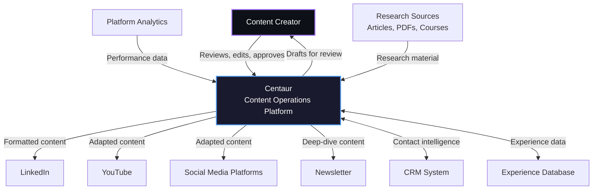
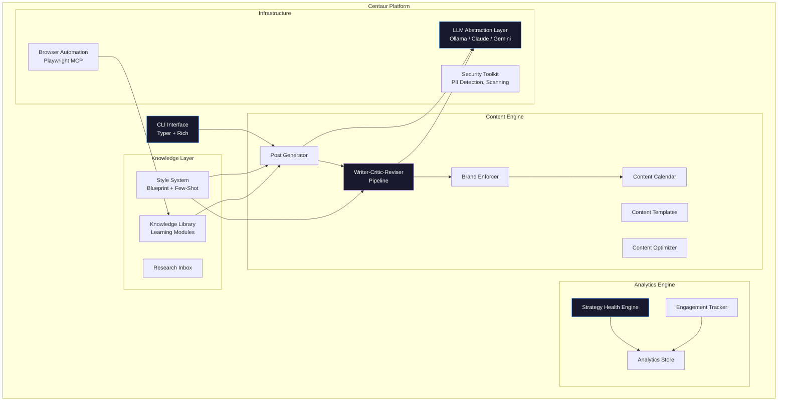
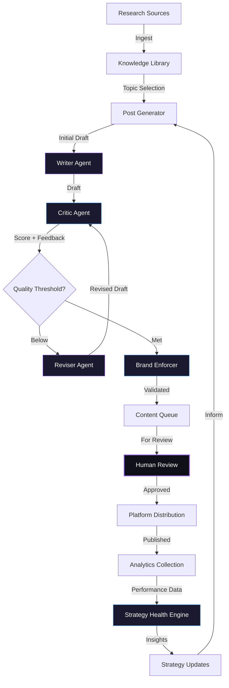
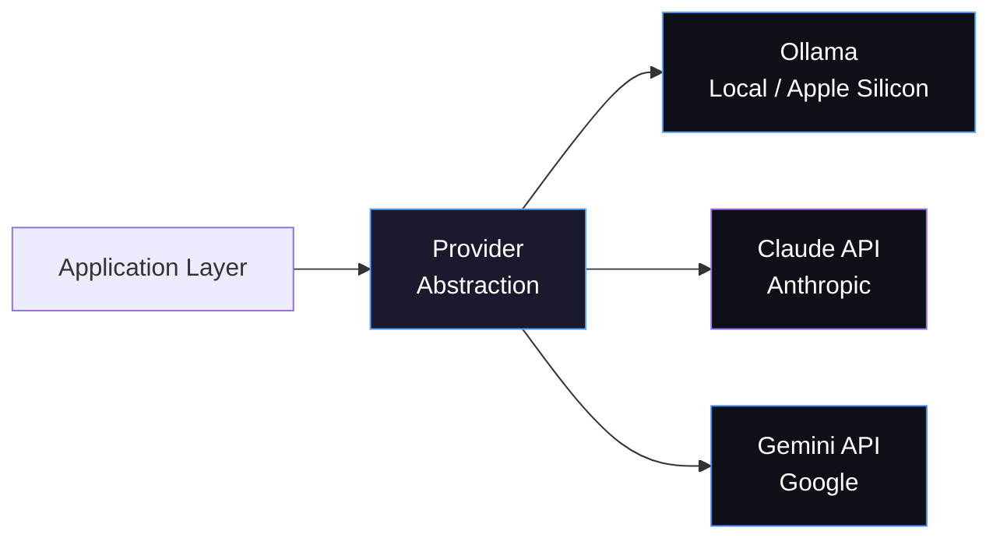
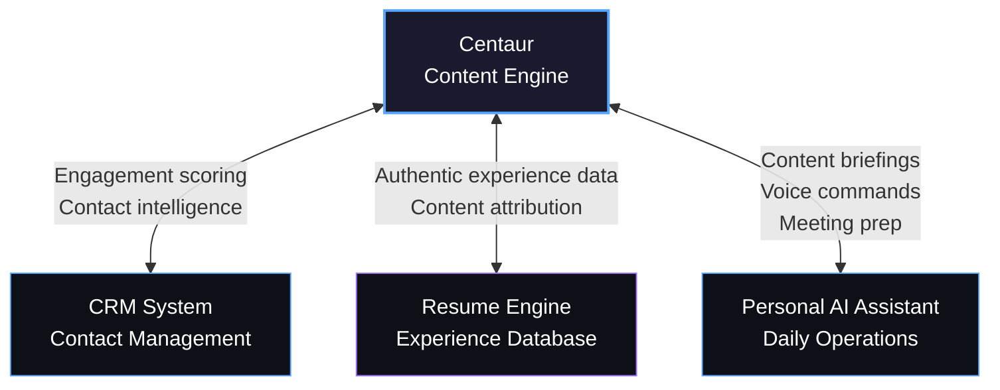

# Architecture

> System design documentation for Centaur — how the system is structured and why.

---

## Design Philosophy

Three principles guide every architectural decision:

1. **Human-in-the-Loop First** — Every piece of content requires human approval before publication. This is a deliberate constraint, not a limitation. Platform algorithms penalize detectable AI content, and authentic voice requires human judgment. The system produces drafts, not posts.

2. **Local-First with Cloud Fallback** — Local models handle research and first drafts (cost-free, private, low-latency). Cloud APIs handle quality-critical tasks where accuracy matters most. Tasks route based on requirements with graceful degradation between providers.

3. **Composition over Monolith** — The system is composed of specialized modules that communicate through defined interfaces. Each module does one thing well. New capabilities are added as new modules, not by expanding existing ones.

---

## System Context (C4 Level 1)

**External integrations** connect via MCP (Model Context Protocol) for real-time data exchange. The CRM integration enables engagement-driven contact scoring. The experience database provides authentic source material for content creation.

---

## Container Architecture (C4 Level 2)

---

## Key Design Decisions

| Decision | Choice | Rationale | Alternatives Considered |
|----------|--------|-----------|------------------------|
| **Content approval model** | Human-in-the-loop required | Platform algorithms penalize AI content; authenticity is the competitive moat | Full automation with quality thresholds — rejected |
| **Platform priority** | LinkedIn-first, adapt via transmutation | Direct professional impact; other platforms receive adapted content | Multi-platform from day one — rejected (scope) |
| **Voice preservation** | Few-shot learning with style analysis | Up to 23.5x accuracy improvement over zero-shot; immediate iteration without retraining | Model fine-tuning — deferred to Phase 4 when volume demands |
| **LLM strategy** | Local-first with cloud fallback | Cost control + privacy for routine tasks; quality optimization for critical tasks | API-only (cost), local-only (quality gaps) |
| **Quality assurance** | Multi-agent pipeline + deterministic rules | Specialized agents outperform single-pass generation; rule engine catches objective violations | Single-prompt with detailed instructions — insufficient quality |
| **Knowledge management** | File-system-first, Markdown, git-tracked | Zero dependencies, version-controlled evolution, directly readable by all system components | Vector database (premature), Notion/Obsidian (external dependency) |
| **Analytics approach** | Platform export ingestion with anomaly detection | Richer data from native exports; longitudinal tracking with version attribution | Manual tracking (doesn't scale), API integration (restricted) |
| **Strategy evolution** | Data-driven with version tagging | Controlled comparison of strategy changes; decisions based on measured outcomes | Intuition-based iteration — rejected |
| **Browser automation** | Playwright via MCP | Real browser context for JS rendering, authentication, complex interactions | Custom scrapers (fragile), API integrations (limited availability) |
| **Security** | 9-phase pre-commit scanner | Defense-in-depth: secrets, PII, paths, dependencies, custom terms, compliance | Basic .gitignore rules — insufficient |

---

## Primary Data Flow

The pipeline forms a **closed feedback loop**: published content generates analytics data, which informs strategy adjustments, which shape future content generation. Every piece of content is tagged with the strategy and style versions that produced it, enabling controlled attribution analysis.

---

## LLM Abstraction

The system abstracts across three LLM providers through a unified interface:

| Provider | Use Case | Advantage |
|----------|----------|-----------|
| **Ollama** | Research, first drafts, embeddings | Free, private, low-latency, runs on Apple Silicon |
| **Claude** | Style transfer, final polish | Highest accuracy for voice preservation |
| **Gemini** | Multimodal analysis, large context | Image processing, PDF analysis, 1M+ token window |

Tasks route based on requirements. If a preferred provider is unavailable, the system falls back gracefully to the next best option.

---

## Security Posture

Security is built into the development workflow, not bolted on after:

- **Pre-commit validation** — A 9-phase scanner runs before every commit, checking for secrets, PII, hardcoded paths, sensitive files, dangerous patterns, and compliance
- **Runtime protection** — Prompt injection detection, input sanitization, path traversal prevention, and secure file operations
- **PII detection** — Automated scanning using Presidio and spaCy to prevent personal data leaks
- **Dependency auditing** — Known vulnerability checks against requirements
- **Data isolation** — Content, strategy documents, and personal data are architecturally separated from code and never enter version control

---

## Cross-Project Integration

Centaur is designed to operate within a broader project ecosystem via MCP (Model Context Protocol):

Integration workflows are designed but privacy-preserving — each system shares only the minimum data needed for its function. The content engine never receives raw CRM data; it receives engagement context. The resume engine provides experience summaries, not full records.

---

*Architecture documentation reflects the current system design. Source code is maintained in a private repository.*

Copyright 2026 TJ Neary. All Rights Reserved.
