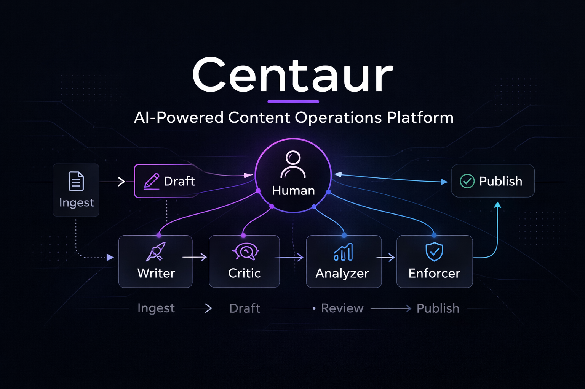

<!--  -->

# Centaur

**An AI-powered content operations platform that automates research-to-draft pipelines while preserving authentic voice through multi-agent quality control and deterministic brand enforcement.**

> *In chess, a "Centaur" is a human-AI team that consistently outperforms both humans and AI playing alone. Centaur applies this principle to content creation: the human provides voice, judgment, and lived experience — AI handles research, drafting, formatting, and analysis. The result is content that is authentically human at scale.*

---

## The Problem

Professional thought leadership requires a punishing volume of high-quality content — researching trends, drafting posts, maintaining brand voice, optimizing for platform algorithms, tracking engagement, and iterating on strategy. Most professionals can sustain this for a few weeks before the pipeline collapses.

AI content tools solve the volume problem but create a new one: **generic, detectable output that erodes credibility.** Platform algorithms increasingly penalize obviously AI-generated content, and audiences can feel the difference.

## The Approach

Centaur is a **human-in-the-loop content operations platform** that sits between these extremes. It automates the research-to-draft pipeline while preserving authentic voice through three mechanisms:

1. **Style fingerprinting** — The system learns a creator's voice from their existing writing, capturing quantitative patterns that go beyond "write like this person"
2. **Multi-agent quality control** — Specialized AI agents draft, critique, and refine content in an iterative loop, each focused on a different quality dimension
3. **Deterministic brand enforcement** — A rule engine validates every draft against measurable constraints before it reaches human review, catching violations automatically and saving human attention for subjective quality judgment

The system never auto-posts. Every piece of content is queued for human review, editing, and approval. This is a deliberate architectural constraint — authenticity cannot be automated.

---

## Architecture Highlights

### Multi-Agent Content Pipeline

Instead of generating content in a single prompt, Centaur uses a **Writer-Critic-Reviser pipeline** — three specialized AI agents that iteratively refine content. The Writer drafts, the Critic evaluates against quality criteria, and the Reviser addresses specific critique points while preserving voice and intent. The loop continues until quality thresholds are met.

This approach produces measurably better output than single-pass generation because each agent has a focused role and evaluation criteria.

### Multi-Provider LLM Architecture

The system abstracts across three LLM providers through a unified interface:
- **Local models** (Ollama on Apple Silicon) handle research and first drafts — cost-free, private, low-latency
- **Cloud APIs** (Claude, Gemini) handle quality-critical tasks like style transfer — highest accuracy where it matters most
- Tasks route automatically based on requirements, with graceful fallback between providers

### Analytics-Driven Strategy Iteration

Content strategy isn't static. Centaur includes an analytics engine that ingests platform performance data, runs anomaly detection, and produces multi-signal assessments. Strategy and style rules evolve based on measured outcomes, not intuition. Every piece of content is tagged with strategy and style versions for controlled attribution analysis.

> See [ARCHITECTURE.md](./ARCHITECTURE.md) for the full system design, data flow diagrams, and design decision log.

---

## Features

| Feature | Technical Implementation | Business Value |
|---------|------------------------|----------------|
| **Style Fingerprinting** | Few-shot learning from 22+ writing samples, quantitative voice analysis | Content that passes the "authenticity test" — indistinguishable from the creator's own writing |
| **Multi-Agent Draft Pipeline** | Writer-Critic-Reviser iterative loop with specialized scoring per agent | Higher quality output than single-prompt generation; catches issues before human review |
| **Brand Enforcement** | Deterministic rule engine with automated compliance checking | Eliminates measurable style violations; human review focuses on substance, not mechanics |
| **Platform Optimization** | Algorithm-aware formatting, engagement protocol design, timing analysis | Content reaches the intended audience instead of being suppressed by platform algorithms |
| **Analytics Engine** | Platform export ingestion, anomaly detection, multi-signal verdict system | Data-driven strategy iteration; measure what works and adjust systematically |
| **Knowledge Pipeline** | Source ingestion, learning module synthesis, content attribution tracking | Research compounds into a reusable knowledge library instead of being consumed and forgotten |
| **Multi-Provider LLM** | Unified interface across Ollama (local), Claude API, Gemini API | Cost control, data privacy, provider resilience — right model for each task |
| **Content Calendar** | Lifecycle management with version-tagged attribution | Full visibility from draft to publication with performance tracking |
| **Education Pipeline** | Course content extraction, learning module creation, content waterfall | Training materials become thought leadership content through systematic transformation |
| **Cross-Platform Strategy** | 7 platform-specific strategies with content adaptation frameworks | One research investment produces content across LinkedIn, YouTube, newsletter, social media |

---

## Metrics

| Metric | Value |
|--------|-------|
| Python modules | 41 |
| Lines of code | ~8,000 |
| Test suite | 209 tests across 10 files |
| Operational scripts | 5 |
| Platform strategies | 7 |
| Documented design decisions | 10 (with rationale and alternatives considered) |
| Security scanner phases | 9 |
| Writing samples analyzed | 22+ |

---

## Technology Stack

| Layer | Technologies |
|-------|-------------|
| **Language** | Python 3.12+ (running 3.14) |
| **ML / Embeddings** | PyTorch (MPS/Apple Silicon), Sentence-Transformers, Hugging Face |
| **LLM Providers** | Ollama (local), Anthropic Claude API, Google Gemini API |
| **NLP / PII** | Presidio, spaCy |
| **CLI** | Typer, Rich |
| **Browser Automation** | Playwright (MCP integration) |
| **Analytics** | openpyxl, custom anomaly detection engine |
| **Testing** | pytest (coverage, async support), 209 tests |
| **CI/CD** | GitHub Actions (Ubuntu + macOS matrix) |
| **Security** | Custom 9-phase pre-commit scanner (v5) |
| **Code Quality** | black, ruff, mypy (strict), isort |

---

## Development Approach

Centaur is developed using a **five-agent AI development ecosystem** — multiple AI agents coordinated through shared activity logs, inter-agent handoff notes, and a cross-project message board. Each agent has defined domain lanes, composure conventions, and capability boundaries. This multi-agent development approach itself demonstrates the Centaur philosophy: humans direct, AI executes across parallel workstreams.

The project follows a phased development roadmap with formal product requirements for each phase, a technical decision log documenting every significant architectural choice (with rationale and alternatives considered), and a module registry tracking all components with input/output contracts.

---

## Roadmap

| Phase | Status | Focus |
|-------|--------|-------|
| **Phase 0: First Content** | Complete | Style fingerprinting, content strategy, initial content production |
| **Phase 1: Content Engine** | Complete | Full generation pipeline, multi-agent refinement, analytics, brand enforcement |
| **Phase 2: Research Pipeline** | Next | RAG knowledge base, automated source ingestion, trend monitoring |
| **Phase 3: Multi-Platform** | Planned | Cross-platform distribution, ecosystem integration via MCP, scheduling automation |
| **Phase 4: Education & Advanced** | Future | Learning module publishing, video content pipeline, model fine-tuning |

---

*This is a showcase repository — documentation only. Source code is maintained in a private repository.*

Copyright 2026 TJ Neary. All Rights Reserved.
